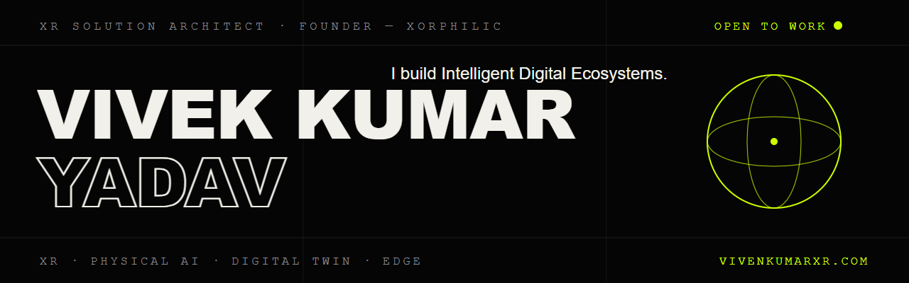

### `XR SOLUTION ARCHITECT · FOUNDER — XORPHILIC`

I don't just build XR — **I build Intelligent Digital Ecosystems.**

I fuse Physical AI, Edge Computing, IoT, ML, and Digital Twins with Extended Reality to build
systems that don't just demo well — they ship and scale. I run local LLMs on a Jetson on my desk,
build real-time voice AI agents, and architect enterprise XR for industry.

```text
NOW        →  XR Solution Architect
COMMUNITY  →  Founder, XoRphilic — 1000+ students mentored into XR
CERTIFIED  →  Unity (Programmer & VR) · AWS GenAI · Intel AI · GCP
```

#### Selected work

| Project | What it is |
|---|---|
| [Real-Time Interruptible Voice AI Agent](https://github.com/vivenkumarXR/Real-Time-Interruptible-Voice-AI-Agent) | Talk over it mid-sentence — it adapts. Llama 3 + Flask + Web Speech API · [demo](https://youtu.be/K5RSe_p_f7A) |
| VR Vault Trainer | Procedural assembly/disassembly training in VR · [demo](https://youtu.be/ynAnU8y7F1g) |
| [AR Workbench](https://github.com/vivenkumarXR/ARWorkbench) | IoT sensor data made intuitive through AR overlays |
| [vivenengine](https://github.com/vivenkumarXR/vivenengine) | A game engine from scratch in C++ |

#### Find me

**[vivenkumarxr.com](https://vivenkumarxr.com)** · [LinkedIn](https://www.linkedin.com/in/vivenkumarxr/) · [Medium](https://medium.com/@vivenkumarXR) · [X](https://x.com/vivenkumarXR) — `@vivenkumarXR` everywhere · [Discord](https://discord.gg/NPVKsEny)

`● OPEN TO — CONSULTING / KEYNOTES / ADVISORY`
